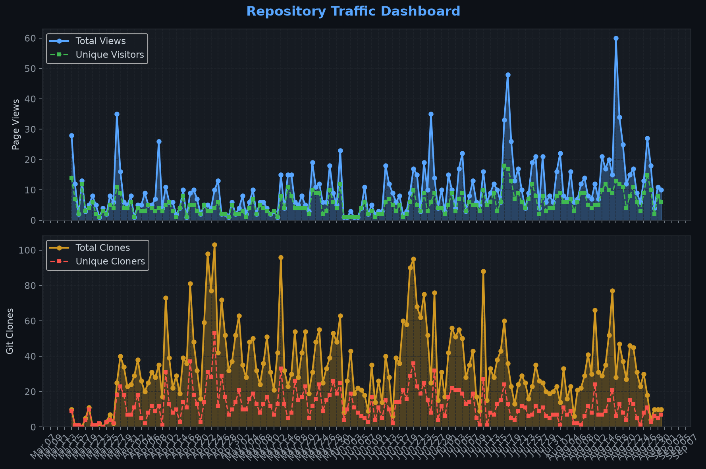
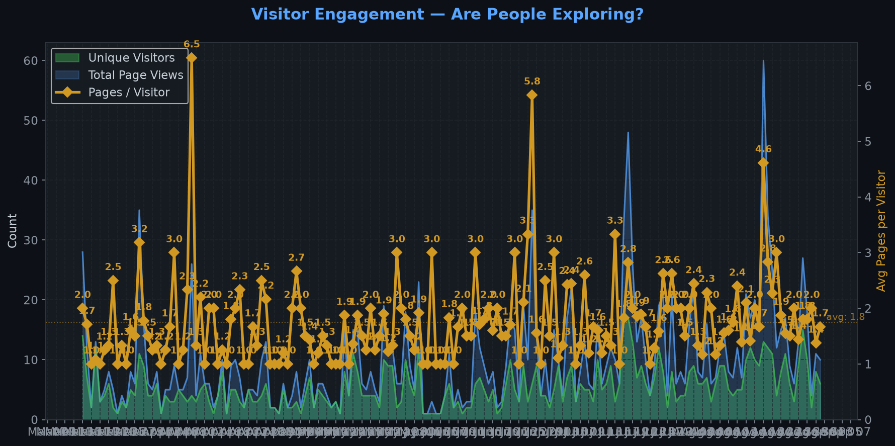
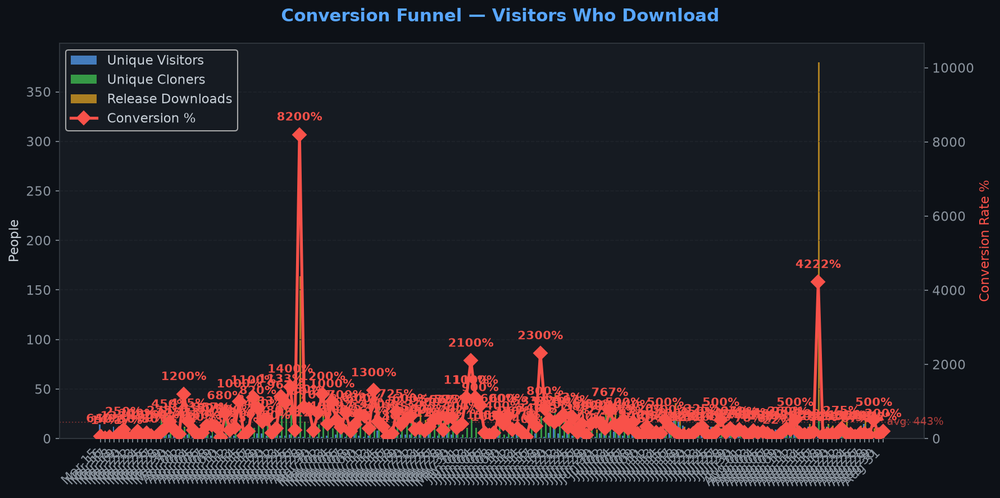
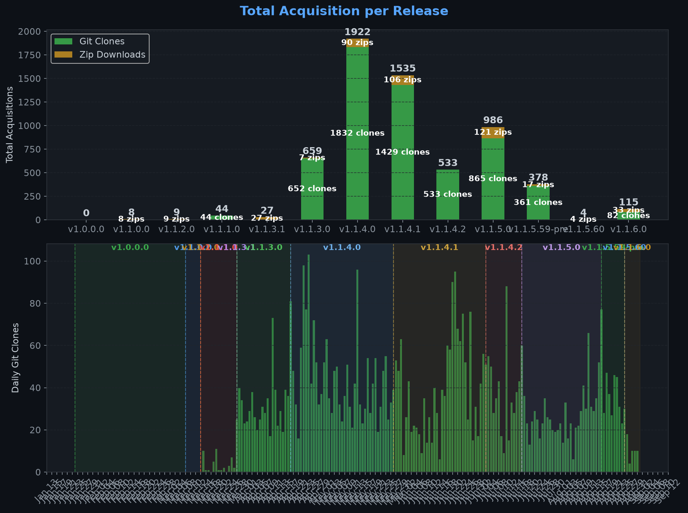
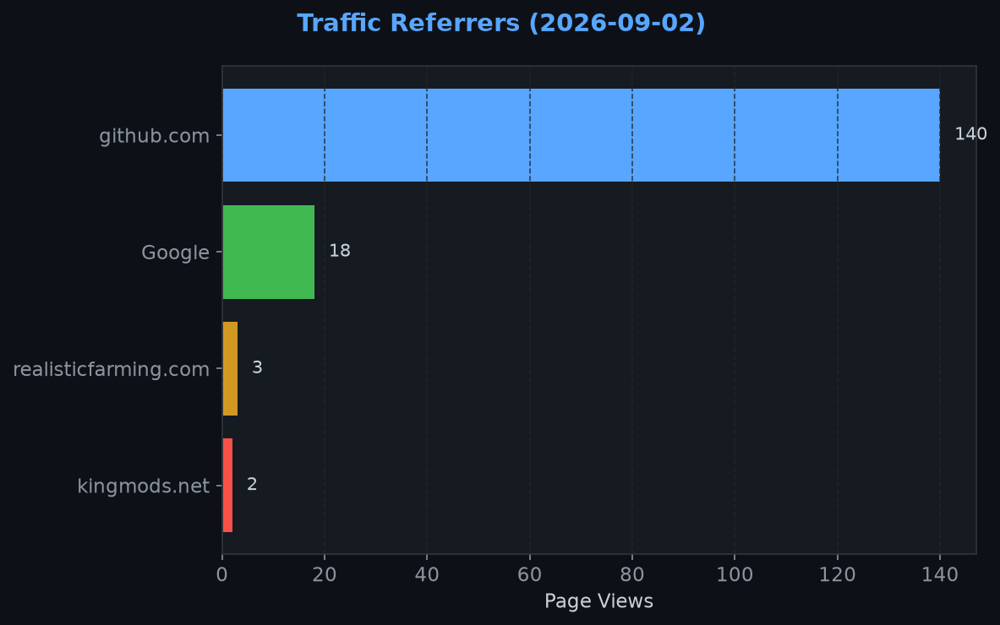
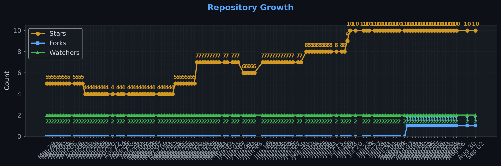

# Repository Traffic Dashboard

**Last updated:** 2026-09-02T00:53:32Z
**Days tracked:** 134 | **Download snapshots:** 524 (hourly)

---

## Views & Clones (14-day window, preserved forever)

| Metric | 14-Day Total | Unique |
|--------|-------------|--------|
| Page Views | 261 | 85 |
| Git Clones | 366 | 88 |

> **Engagement:** 3.0 pages per visitor (14-day avg)

---

## Visitor Engagement

> Higher = visitors exploring more pages. 1.0 = bounce. 3.0+ = deeply engaged.

---

## Conversion Funnel

> **14-day conversion:** 510 of 85 visitors cloned or downloaded (**600.0%**)
>
> Unique cloners: 88 | Release downloads: 422

---

## Total Acquisition per Release (Downloads + Clones)

| Channel | Count |
|---------|-------|
| Zip Downloads | 422 |
| Git Clones (14-day) | 366 |
| **Total Acquisitions** | **788** |

---

## Referrers

| Source | Views | Unique |
|--------|-------|--------|
| github.com | 140 | 59 |
| Google | 18 | 13 |
| realisticfarming.com | 3 | 2 |
| kingmods.net | 2 | 2 |

---

## Repository Growth

| Metric | Current |
|--------|---------|
| Stars | 10 |
| Forks | 1 |
| Watchers | 2 |

---

## Top Pages (14-day)

| Page | Views | Unique |
|------|-------|--------|
| `/Realistic-Farming/FS25_TaxMod` | 124 | 78 |
| `/Realistic-Farming/FS25_TaxMod/releases` | 26 | 17 |
| `/Realistic-Farming/FS25_TaxMod/releases/tag/v1.1.6.0` | 17 | 16 |
| `/Realistic-Farming/FS25_TaxMod/releases/tag/v1.1.5.0` | 12 | 11 |
| `/Realistic-Farming/FS25_TaxMod/pull/34` | 8 | 3 |
| `/Realistic-Farming/FS25_TaxMod/issues` | 8 | 2 |
| `/Realistic-Farming/FS25_TaxMod/pull/22` | 6 | 3 |
| `/Realistic-Farming/FS25_TaxMod/releases/tag/v1.1.5.59-pre` | 5 | 5 |
| `/Realistic-Farming/FS25_TaxMod/pull/28` | 5 | 2 |
| `/Realistic-Farming/FS25_TaxMod/branches` | 4 | 2 |

---

## Data Files

| File | Description | Granularity |
|------|-------------|-------------|
| [daily.json](daily.json) | Views & clones per day (never expires) | Daily |
| [downloads.json](downloads.json) | Release download snapshots | Hourly |
| [referrers.json](referrers.json) | Referrer snapshots | Daily |
| [metadata.json](metadata.json) | Stars, forks, watchers | Daily |
| [stats.json](stats.json) | Combined legacy snapshots | 6-hourly |

---
*Hourly download tracking + full dashboard with engagement metrics every 6 hours*
*Auto-generated by [traffic-stats.yml](../../.github/workflows/traffic-stats.yml)*
