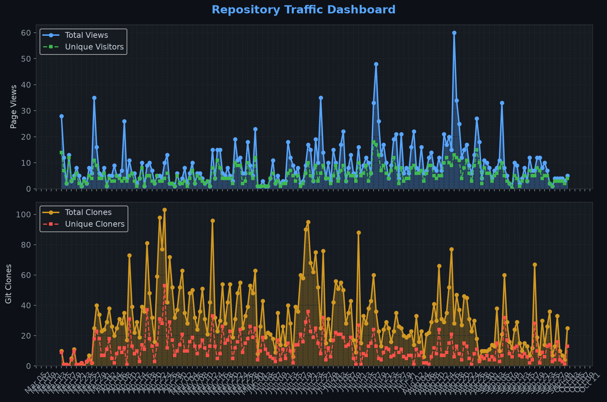
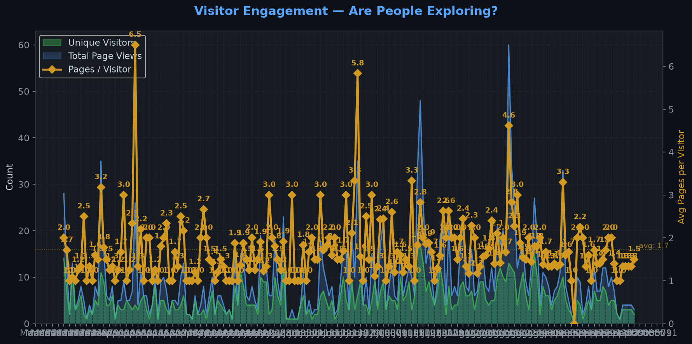
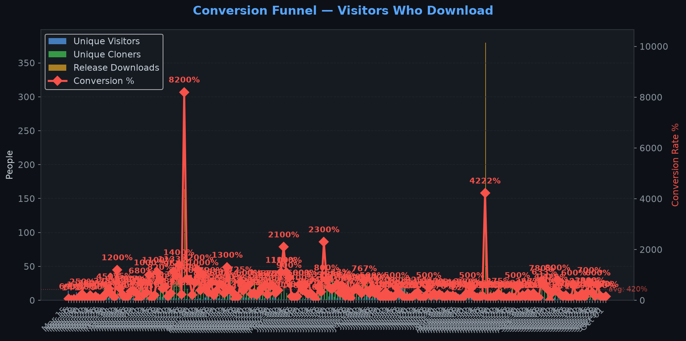
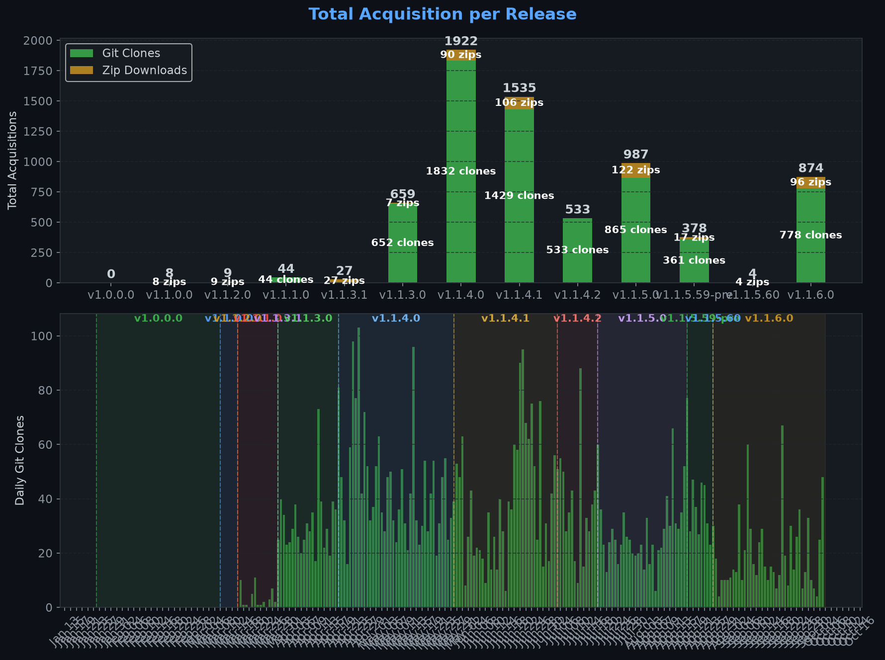
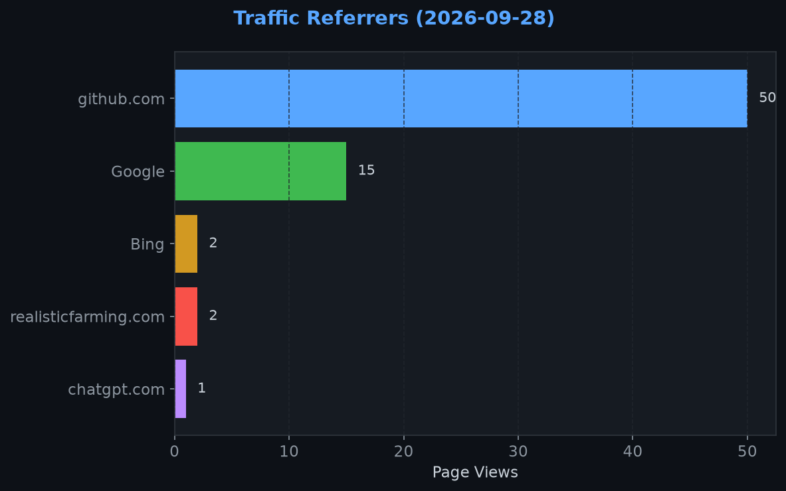
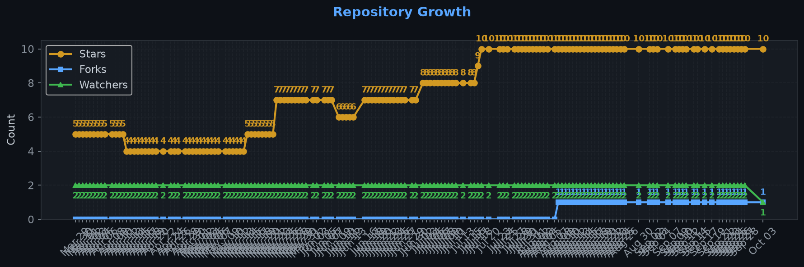

# Repository Traffic Dashboard

**Last updated:** 2026-10-03T18:58:03Z
**Days tracked:** 154 | **Download snapshots:** 593 (hourly)

---

## Views & Clones (14-day window, preserved forever)

| Metric | 14-Day Total | Unique |
|--------|-------------|--------|
| Page Views | 83 | 51 |
| Git Clones | 299 | 106 |

> **Engagement:** 1.6 pages per visitor (14-day avg)

---

## Visitor Engagement

> Higher = visitors exploring more pages. 1.0 = bounce. 3.0+ = deeply engaged.

---

## Conversion Funnel

> **14-day conversion:** 589 of 51 visitors cloned or downloaded (**1154.9%**)
>
> Unique cloners: 106 | Release downloads: 483

---

## Total Acquisition per Release (Downloads + Clones)

| Channel | Count |
|---------|-------|
| Zip Downloads | 483 |
| Git Clones (14-day) | 299 |
| **Total Acquisitions** | **782** |

---

## Referrers

| Source | Views | Unique |
|--------|-------|--------|
| github.com | 27 | 25 |
| Google | 16 | 13 |
| Bing | 1 | 1 |
| alice.yandex.ru | 1 | 1 |
| kingmods.net | 1 | 1 |
| realisticfarming.com | 1 | 1 |

---

## Repository Growth

| Metric | Current |
|--------|---------|
| Stars | 10 |
| Forks | 1 |
| Watchers | 1 |

---

## Top Pages (14-day)

| Page | Views | Unique |
|------|-------|--------|
| `/Realistic-Farming/FS25_TaxMod` | 55 | 45 |
| `/Realistic-Farming/FS25_TaxMod/releases/tag/v1.1.6.0` | 14 | 12 |
| `/Realistic-Farming/FS25_TaxMod/releases` | 7 | 6 |
| `/Realistic-Farming/FS25_TaxMod/blob/07aa6c435dfde6d97b529005711feafa1014126c/src/gui/RfPdaMenuPage.lua` | 2 | 2 |
| `/Realistic-Farming/FS25_TaxMod/blob/main/main.lua` | 1 | 1 |
| `/Realistic-Farming/FS25_TaxMod/issues/58` | 1 | 1 |
| `/Realistic-Farming/FS25_TaxMod/pull/31/files/6144690569560fa4cb0a5368cdf37157cfc94718` | 1 | 1 |
| `/Realistic-Farming/FS25_TaxMod/pull/54` | 1 | 1 |
| `/Realistic-Farming/FS25_TaxMod/pull/59` | 1 | 1 |

---

## Data Files

| File | Description | Granularity |
|------|-------------|-------------|
| [daily.json](daily.json) | Views & clones per day (never expires) | Daily |
| [downloads.json](downloads.json) | Release download snapshots | Hourly |
| [referrers.json](referrers.json) | Referrer snapshots | Daily |
| [metadata.json](metadata.json) | Stars, forks, watchers | Daily |
| [stats.json](stats.json) | Combined legacy snapshots | 6-hourly |

---
*Hourly download tracking + full dashboard with engagement metrics every 6 hours*
*Auto-generated by [traffic-stats.yml](../../.github/workflows/traffic-stats.yml)*
