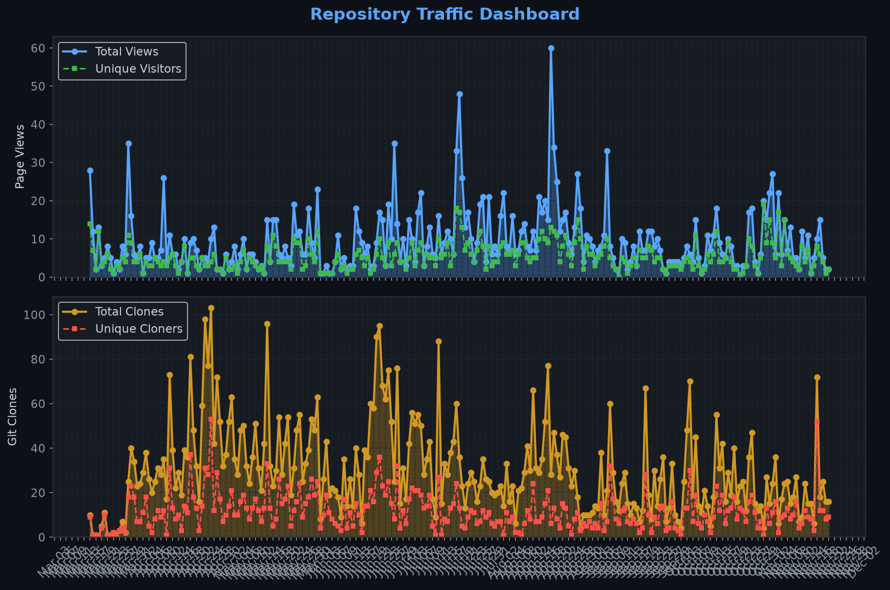

# Repository Traffic Dashboard

**Last updated:** 2026-11-15T00:41:23Z
**Days tracked:** 175 | **Download snapshots:** 696 (hourly)

---

## Views & Clones (14-day window, preserved forever)

| Metric | 14-Day Total | Unique |
|--------|-------------|--------|
| Page Views | 158 | 89 |
| Git Clones | 262 | 100 |

> **Engagement:** 1.7 pages per visitor (14-day avg)

---

## Visitor Engagement

> Higher = visitors exploring more pages. 1.0 = bounce. 3.0+ = deeply engaged.

---

## Conversion Funnel

> **14-day conversion:** 721 of 89 visitors cloned or downloaded (**810.1%**)
>
> Unique cloners: 100 | Release downloads: 621

---

## Total Acquisition per Release (Downloads + Clones)

| Channel | Count |
|---------|-------|
| Zip Downloads | 621 |
| Git Clones (14-day) | 262 |
| **Total Acquisitions** | **883** |

---

## Referrers

| Source | Views | Unique |
|--------|-------|--------|
| github.com | 48 | 34 |
| Google | 28 | 11 |
| aocr.org | 13 | 13 |
| realisticfarming.com | 5 | 4 |
| Bing | 2 | 2 |
| duck.ai | 1 | 1 |
| kingmods.net | 1 | 1 |
| yandex.ru | 1 | 1 |

---

## Repository Growth

| Metric | Current |
|--------|---------|
| Stars | 11 |
| Forks | 2 |
| Watchers | 2 |

---

## Top Pages (14-day)

| Page | Views | Unique |
|------|-------|--------|
| `/Realistic-Farming/FS25_TaxMod` | 92 | 54 |
| `/Realistic-Farming/FS25_TaxMod/releases/tag/v1.2.0.0` | 18 | 18 |
| `/Realistic-Farming/FS25_TaxMod/releases` | 12 | 11 |
| `/Realistic-Farming/FS25_TaxMod/issues/7` | 5 | 5 |
| `/Realistic-Farming/FS25_TaxMod/issues` | 2 | 2 |
| `/Realistic-Farming/FS25_TaxMod/pull/8` | 2 | 2 |
| `/Realistic-Farming/FS25_TaxMod/tree/main/src` | 2 | 1 |
| `/Realistic-Farming/FS25_TaxMod/blob/main/src/gui/RfEscBootstrap.lua` | 1 | 1 |
| `/Realistic-Farming/FS25_TaxMod/blob/main/textures/ui/menuIcon.dds` | 1 | 1 |
| `/Realistic-Farming/FS25_TaxMod/commit/de2d1c9b605da65ebd2d03413f4a3482bd24d87d` | 1 | 1 |

---

## Data Files

| File | Description | Granularity |
|------|-------------|-------------|
| [daily.json](daily.json) | Views & clones per day (never expires) | Daily |
| [downloads.json](downloads.json) | Release download snapshots | Hourly |
| [referrers.json](referrers.json) | Referrer snapshots | Daily |
| [metadata.json](metadata.json) | Stars, forks, watchers | Daily |
| [stats.json](stats.json) | Combined legacy snapshots | 6-hourly |

---
*Hourly download tracking + full dashboard with engagement metrics every 6 hours*
*Auto-generated by [traffic-stats.yml](../../.github/workflows/traffic-stats.yml)*
